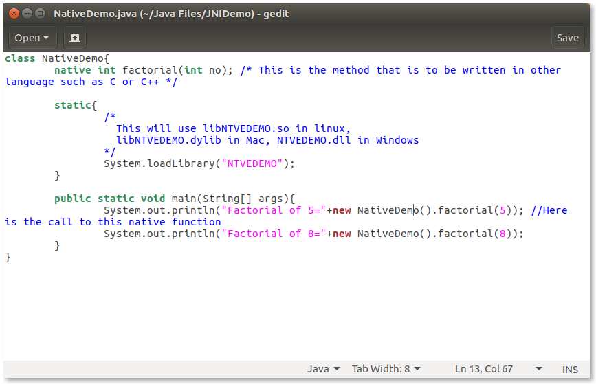

# Using JNI

This has been tried on Ubuntu 16.10
Proceed with further steps if jdk, gcc have already been installed

I have installed openjdk 8 and gcc 6.2

Steps:
* Create file NativeDemo.java and add following contents and save it:
	
* Compile this java file using 
	javac NativeDemo.java
	Now if you try to run this java file you will get this error
	
* This is because a library for this native method has not been created yet. So for that purpose first generate the header file from this class file using following command
	javah NativeDemo
	
	A file like this will be created in the same directory as class file:
	
	It will have the following contents in it:
	
	In this we copy the highlighted code. This is the native method definition that you will write in C
* Create a C file and add the following code in it:
	
	Here the name of the C file may or may not be the same as the library. This doesn't matter because using GCC you can change the name of the executable. Note that the first line includes jni.h which will be included in the jdk/include/ path. This path will be included in later steps. The second line includes NativeDemo.h which is the name of the header file generated using javah. Now this header file must be in the directory of the C file while compiling using GCC.
* Now compile this C file using following GCC command:
	gcc -o libNTVEDEMO.so -shared -I/usr/lib/jvm/java-8-openjdk-amd64/include NTVEDEMO.C -lc
	
	If you don't include the NativeDemo.h file in the same directory as the C file then you get an error as seen from the first command execution.
	-o is used to specify the name of the executable file
	Replace .so with .dylib if you're on a Mac, or .dll if you're on Windows (remove the lib part from the file name as well if you're on Windows). Also, replace /path/to/jdk/headers with the full path to the directory containing the file jni.h. If you don't know where that is, you can use the locate jni.h command on UNIX-like systems.
	You will see a new file libNTVEDEMO.so in the directory of C file:
	
* Now copy this library file in the directory of the class file
	
* Now to run the java code that uses native method you **can't** use the standard command 
	java NativeDemo
	This will give the following error:
	
	To properly execute it we need to specify the location of this library file via java.library.path. This will tell java to search for library files in current directory.
	
	Thus you can see the required output. Here the factorial is calculated by C.

Thus, the advantage of native codes can be used by higher level languages such as Java.

References:
[Calling C code from Java using JNI](http://stuf.ro/calling-c-code-from-java-using-jni)
