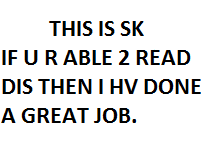
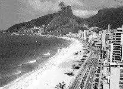

* Create n images with resolution exactly same as image.jpg their names should begin with textHidden Eg. textHidden1.png.
  These are the images that should hold your code words like the following image:
  
  
  
* Use Codes.txt to specify bit planes for n images
* Run HiddenText_Reveal.m. This will generate n images that have your code messages encoded
* Now you can decode using Bitplane_Slicing_1411113.m

For transmitting these code messages, send Codes.txt and imageX.png. Here X goes from 1 to no of images

Eg. Here the code message image is merged into image.jpg by replacing the 2nd LSB of each pixel

 

\+

=

The last 2 images look the same don't they
But the last one has your code.

Psst..
Use this tool carefully to send your code messages to your spy team :-P
